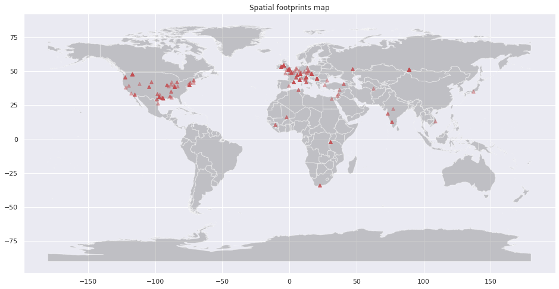
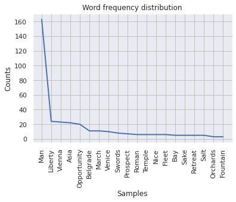

# Lab 7 -- Geoparsing with Python
## Introduction
Using Python for geoparsing and mapping .txt files. The task is to read the text from a website, extract locations, draw them on a map, and create a word frequency plot. The challenge this week is to create a function that takes a URL as an argument and output a map and a plot.. 
## Result
The book I want to explore is *Travels into Turkey*.The outputs are a spatial footprint map and a word frequency plot. Here are the result.

## Desicusion
tell how you developed it, if there were any major challenges (and how you debugged them)
## question
* Is the gazetteer we're using appropriate for the text? What might be some of the challenges of using Nominatim with a book published in 1859?
* How accurate do you think the outputs are? Are there any city names that seem suspect? If so, what are some Natural Language Processing methods that you could use to filter words that might be city names, but probably weren't intended as city references in the text?
* What are some alternative approaches to mapping the data? The tutorial here uses duplicate entries and opacity to present a type of "color ramp": could this be done better?
